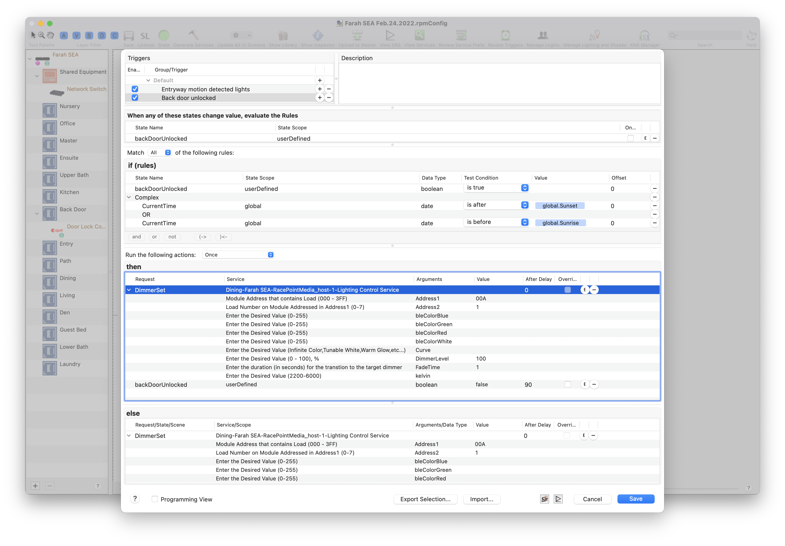

# Savant HTTP Server

This binary is designed to run on Savant's smart hosts and act as an HTTP
server.

Future work here includes supporting all commands, as well as supporting
allow-listed IPs for calling the server more securely.

## Setup

1. Run the build command
2. Copy the binary to the Savant host
3. Copy the systemctl config (lib/savant-server.service) to the savant host
   under /lib/systemd/system/savant-server.service
4. Run `sudo systemctl daemon-reload`
5. Enable the service via `sudo systemctl enable savant-server`
6. Start the service via `sudo systemctl start savant-server`

## Example usage

You can set up the bulk of the logic however you want – either you have your
external system calling directly into Savant to run specific operations, or you
update a state in Savant and let the trigger system perform the operations.

In my case, I've opted for the latter to keep a clearer separation of domains.

I have added into my home-assistant configuration something like the
[configuration.yaml](./example/homeassistant/configuration.yaml) and set up a
trigger something like [this](./example/homeassistant/automation.yaml).

In Savant, I have a trigger that performs an action based on state:

And voila, it works!
